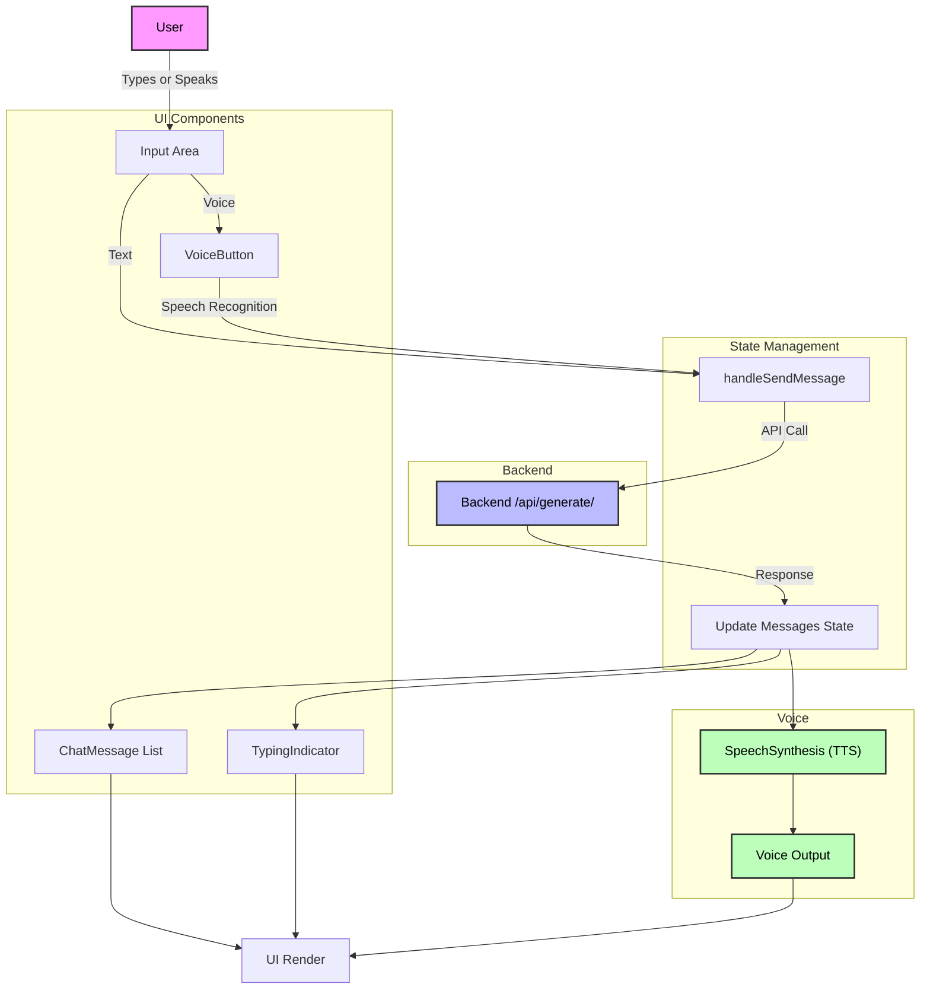
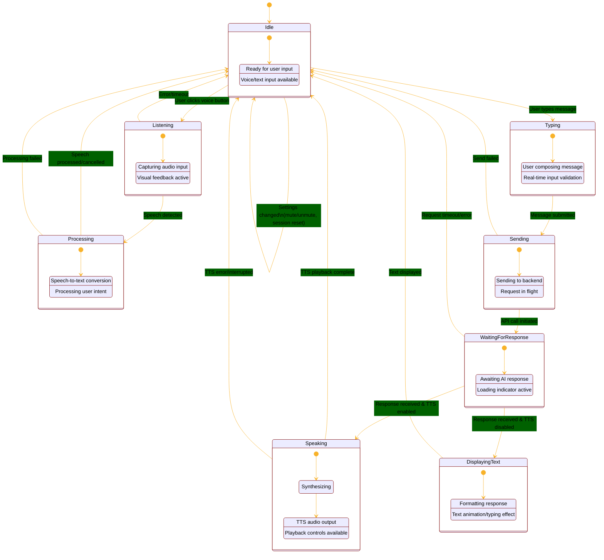

# Lovable Chatbot Project

## Project Info

**Live URL:** https://lovable.dev/projects/346d97cd-baa4-4aec-affe-b14c90da28a0

---

## Table of Contents
1. [Features](#features)
2. [Tech Stack](#tech-stack)
3. [Getting Started](#getting-started)
4. [Usage](#usage)
5. [Architecture Overview](#architecture-overview)
6. [Deployment](#deployment)
7. [Custom Domain](#custom-domain)

---

## Features
- Conversational AI chatbot
- Voice input and output (speech recognition and TTS)
- Session management and chat history
- Modern UI with shadcn-ui and Tailwind CSS

---

## Tech Stack

### Frontend
- Vite
- TypeScript
- React
- shadcn-ui
- Tailwind CSS

### Backend
- FastAPI
- Python
- LangChain
- (Add any other backend libraries or services you use, e.g., SQLAlchemy, SQLite, etc.)

---

## Getting Started

### Prerequisites
- Node.js & npm ([install with nvm](https://github.com/nvm-sh/nvm#installing-and-updating))

### Installation & Running Locally
```sh
# Clone the repository
git clone <YOUR_GIT_URL>
cd <YOUR_PROJECT_NAME>

# Install dependencies
npm i

# Start the development server
npm run dev
```

---

## Usage
- Type or speak your message in the input area.
- The bot will respond with text and optionally with voice.
- Use the mute/unmute button to control TTS output.
- View or delete chat history as needed.

---

## Architecture Overview

### Main Chat Flow
This diagram shows the journey of a user message through the chat app:
- The user can type or speak a message.
- The input is processed and sent to the backend.
- The backend response updates the UI and may trigger voice output.
- Components are grouped by their roles (UI, State Management, Voice, Backend).
- Arrows show the direction of data and control flow.



### State Management (Detailed)
This diagram illustrates the main states of the chat application and how it transitions between them:
- Each state block represents a mode the app can be in (e.g., waiting for input, processing speech, waiting for a backend response).
- Arrows show how user actions, backend responses, or errors move the app from one state to another.
- Error and configuration transitions are included for completeness.
- Colors and notes help clarify each state and transition.



---

## Deployment
Simply open [Lovable](https://lovable.dev/projects/346d97cd-baa4-4aec-affe-b14c90da28a0) and click on Share -> Publish.

---

## Custom Domain
To connect a domain, navigate to Project > Settings > Domains and click Connect Domain.

Read more here: [Setting up a custom domain](https://docs.lovable.dev/tips-tricks/custom-domain#step-by-step-guide)

---

## Contributing

Contributions are welcome! To contribute:
- Fork this repository
- Create a new branch for your feature or bugfix
- Make your changes and commit them with clear messages
- Push your branch and open a Pull Request

Please follow the existing code style and conventions. For major changes, open an issue first to discuss what you would like to change.

---

## License

This project is licensed under the MIT License. See the [LICENSE](../LICENSE) file for details.

---

## Acknowledgements

- [Lovable](https://lovable.dev/) for the project platform
- [shadcn-ui](https://ui.shadcn.com/) for UI components
- [Tailwind CSS](https://tailwindcss.com/) for styling
- [Mermaid](https://mermaid-js.github.io/) for diagrams
- [Vite](https://vitejs.dev/) and [React](https://react.dev/) for the frontend framework

Special thanks to all low code frameworks and open-source libraries that made this project possible.
